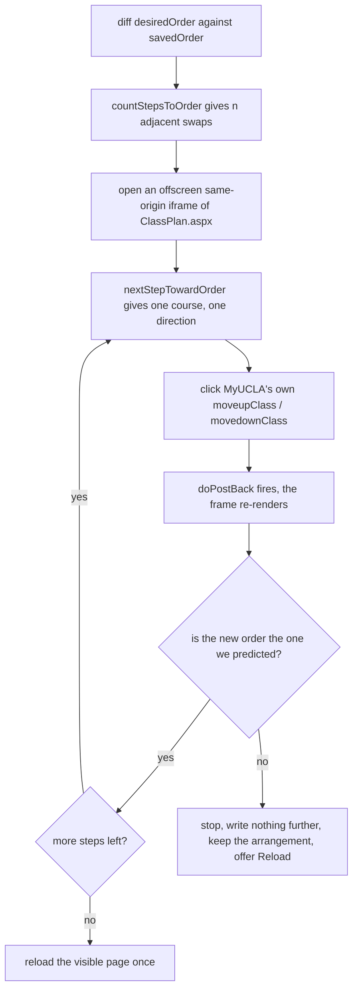

<div align="center">


# Better MyUCLA

**Your class plan, in the order you actually want it.**

An unofficial Chrome extension for the MyUCLA Class Planner.

[Install guide](https://astro-wen.github.io/better-myucla-planner/) ·
[Latest release](https://github.com/Astro-wen/better-myucla-planner/releases/latest) ·
[Contributing](CONTRIBUTING.md)

</div>


MyUCLA moves a class one place per click, and every click is a full page
postback. Getting a class from 13th to 2nd costs eleven clicks and eleven page
loads. This makes it one drag.

Not made by, endorsed by, or affiliated with UCLA.

---

## What you get

|  | |
| --- | --- |
| **Drag to reorder** | Drop a class anywhere in the list. Drag to the top or bottom edge and the page scrolls with you. |
| **Send to the top** | One click from any position. |
| **Jump to a position** | Pick the spot you want out of a dropdown. |
| **Class notes** | 24 characters per class, kept on your own machine. |
| **Collapse** | Fold a class, or all of them, with seat status left on the title line. |
| **Filter** | By course, instructor, page text, or your own note. |
| **Clash list** | Which classes each one collides with, in time or final exam, read from MyUCLA's own popover payload. |
| **Finals week** | Every final exam in your plan on one week, with overlaps in red and the gap named when two land an hour apart. |
| **Grid to class** | Click a meeting in MyUCLA's weekly grid to land on that class in the list below. |

`docs/ROADMAP.md` has the rest, including the optional layout switch and the
things that were considered and declined.

---

## How it works

### It lives on exactly one page

```
https://be.my.ucla.edu/ClassPlanner/ClassPlan.aspx
```

That exact path is the whole of `content_scripts.matches` in the manifest, and
`storage` is the only permission. There is no background service worker, no
host permission beyond that URL, and no server behind any of it.

### Rearranging is local; saving is not

A drag reorders `<tbody>` nodes in your own DOM and stops there. Nothing is
sent, so you can try three arrangements and throw two away for free. The bottom
bar tracks the gap between two arrays: `savedOrder`, the order the server still
believes, and `desiredOrder`, the one on your screen.

Save is the moment those two get reconciled, and it does that using controls
you already had:



Two things fall out of that design.

**Why an offscreen frame.** Each move is an ASP.NET UpdatePanel postback that
re-renders the page. Eleven moves on the visible page means eleven reloads
under your cursor. The batch runs in a same-origin iframe of the same URL
instead, so the page you are looking at reloads once, at the end. Budgeted at
~1.2s per step, capped at 120 steps and a 15s load timeout per postback.

**Why clicking rather than posting.** The extension never composes a request of
its own. It finds MyUCLA's own `button.link.moveupClass` / `movedownClass`,
checks it against a whitelist, and clicks it. Every write is a thing you could
have done by hand, one confirmed click at a time.

### It fails closed

Before each click the button must pass every one of these, or the run stops:

- it is a `<button>` from that frame's own realm, and a descendant of the card
  it claims to move
- its id is exactly `muClass<digits>` / `mdClass<digits>` for that course, and
  its classes are `link` plus `moveupClass` / `movedownClass`
- `title` and `aria-label` both equal `Move this Class up in the list` for the
  direction being asked for
- its inline `onclick` matches the expected `courseListAction(...)` string
  character for character, including that same course number
- it has no `type` attribute, and no `formaction`, `formmethod` or
  `formenctype`
- `element.form` is `#aspnetForm`, whose method is POST and whose action
  resolves to this exact path
- it is visible and not disabled

After each click the resulting order must equal the order that was predicted
for that step. Any mismatch in page, term, plan id, DOM shape, button identity
or resulting order aborts immediately: nothing further is written, your
arrangement is kept, and a Reload button appears. There is no fuzzy fallback,
because a fuzzy match here moves the wrong class.

The full verified DOM contract is in [`docs/MYUCLA_CONTRACT.md`](docs/MYUCLA_CONTRACT.md).

### What it will not do

Enroll, drop, waitlist, exchange, or watch for open seats. Poll MyUCLA or send
any request of its own. Read or store passwords, cookies, tokens, UIDs, grades,
DARS, or Duo data. These are rules, not defaults; see [`AGENTS.md`](AGENTS.md).

---

## Build it

```bash
npm install
npm run typecheck && npm test && npm run build
```

esbuild bundles four entry points to IIFE, and `public/` is copied wholesale
into `dist/`. `dist/` is not committed. Load it in Chrome via
`chrome://extensions` → Developer mode → Load unpacked → `dist/`. After editing
source you must rebuild **and** press Reload on the extension card.

| Command | What it does |
| --- | --- |
| `node harness/run.mjs drag` | Drives the built extension against an invented Class Planner. Also `idle`, `position`, `top`, `default`, `tidy`. |
| `node harness/probe-position.mjs` | Asserts "move to #N" lands on N from every starting point. |
| `node harness/verify-install.mjs` | Walks the published install guide: zips `dist` the way the release workflow does, unzips, side-loads into a clean profile, checks the card and every injected control. |
| `node harness/chrome-extensions-page.mjs` | Retakes the `chrome://extensions` screenshots for the install guide. |
| `node harness/extension-card.mjs` | Retakes the extension-card screenshot. |
| `node scripts/make-icons.mjs` | Redraws all four icon sizes into `public/icons/`. |

The harness serves an invented fixture at the real URL through Playwright's
`page.route()`, so the content script's `matches` pattern fires without an
account and without touching a real plan. Screenshots land in `harness/shots/`.
**Never paste a real plan into the fixture.**

---

## Where things are written down

| Question | File |
| --- | --- |
| Architecture, seams, and traps already paid for | [`HANDOFF.md`](HANDOFF.md) |
| The verified MyUCLA DOM contract | [`docs/MYUCLA_CONTRACT.md`](docs/MYUCLA_CONTRACT.md) |
| State of play, open questions, what was declined | [`docs/ROADMAP.md`](docs/ROADMAP.md) |
| Where the Class Planner hurts, ranked | [`docs/PAIN_POINTS.md`](docs/PAIN_POINTS.md) |
| A product and UX read of the page | [`docs/UX_AUDIT.md`](docs/UX_AUDIT.md) |
| Version history and the reasoning per change | [`CHANGELOG.md`](CHANGELOG.md) |
| What may be stored and what may never be | [`PRIVACY.md`](PRIVACY.md) |
| Rules no change may break | [`AGENTS.md`](AGENTS.md) |
| How to propose a change | [`CONTRIBUTING.md`](CONTRIBUTING.md) |

Every version bump updates the status line below, adds a `CHANGELOG.md` entry,
and refreshes `HANDOFF.md` if the architecture moved.

**Status:** working local beta, `0.10.3`. Not on the Chrome Web Store.

---

## License

MIT
